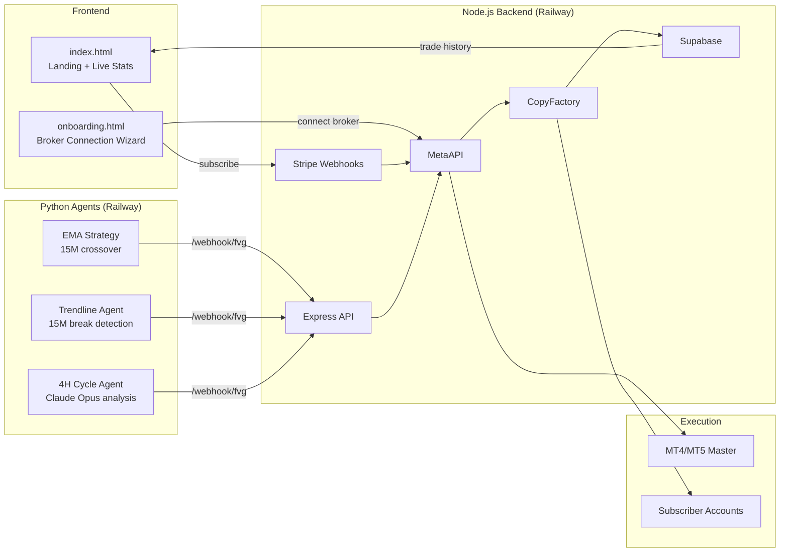

# Automated Trading Platform

Automated XAU/USD (gold) trading system with subscription-based signal copying to MT4/MT5 accounts.

> **This is a portfolio/demo version.** All credentials have been removed. The system runs in demo mode by default — no live trades are placed.

---

## Architecture



See [`docs/architecture.md`](docs/architecture.md) for the full diagram with all components.

---

## Tech Stack

| Layer | Technology |
|-------|-----------|
| Frontend | HTML5, CSS3, Vanilla JS |
| Backend | Node.js 20, Express 4 |
| Database | Supabase (PostgreSQL) |
| Payments | Stripe (Checkout + Webhooks) |
| Broker API | MetaAPI Cloud |
| Trade copying | CopyFactory |
| AI analysis | Claude Opus (Anthropic) |
| Market data | TwelveData API |
| Notifications | Telegram Bot API |
| Hosting | Railway (backend + Python), Netlify (frontend) |

---

## Project Structure

```
aurora-trading-platform/
├── frontend/
│   ├── index.html          # Landing page with live PnL dashboard
│   ├── onboarding.html     # Post-payment broker connection wizard
│   ├── legal.html          # ToS, privacy policy, risk disclosure
│   └── assets/
│       └── aurora-xau-logo.svg
├── backend/
│   ├── server.js           # Express API (Stripe, MetaAPI, CopyFactory, Supabase)
│   └── package.json
├── automation/
│   ├── runner.py           # Thread launcher for all agents
│   ├── cycle_main.py       # 4H Claude Opus market analysis cycle
│   ├── ema_strategy_main.py # 15M EMA 20/50 strategy agent
│   ├── agent_trendline.py  # Trendline break detection agent
│   ├── agent_hhhl.py       # HHHL structure local MT5 agent
│   ├── data_fetcher.py     # TwelveData OHLCV fetcher
│   ├── indicators.py       # EMA, ATR, pivot point calculations
│   ├── notifier.py         # Telegram + webhook helpers
│   ├── config.py           # Environment config + DEMO_MODE
│   └── requirements.txt
├── docs/
│   └── architecture.md     # Full Mermaid architecture diagram
├── .env.example            # All environment variables (no real values)
├── .gitignore
├── README.md
└── LICENSE
```

---

## Demo Mode

By default, `DEMO_MODE=true` — **no live trades are placed**.

In demo mode:
- Python agents detect signals and log them but skip live webhook calls
- `agent_hhhl.py` exits without connecting to MT5
- Backend `/api/demo/*` endpoints return realistic mock data
- Frontend displays mock trade history and PnL

All live execution paths are disabled at runtime when `DEMO_MODE=true`.

---

## Getting Started

No external accounts are needed to run the demo. `DEMO_MODE=true` is the default — the backend serves mock data and the frontend connects to it via `http://localhost:3000`.

### 1. Clone

```bash
git clone https://github.com/yourusername/aurora-trading-platform
cd aurora-trading-platform
```

### 2. Configure (optional)

```bash
cp .env.example .env
# Edit .env if you want to override any defaults.
# DEMO_MODE=true is already set — no credentials required for the demo.
```

> This public repository is configured for demo/portfolio mode only (`DEMO_MODE=true`). Production deployment requires separate private configuration.

### 3. Start the backend

```bash
cd backend
npm install
node server.js
```

### 4. Open the frontend

Navigate to **http://localhost:3000** — the backend statically serves the frontend, so no separate step or file:// workaround is needed.

---

## Trading Strategies

### EMA 20/50 (15M)
- Entry: 15M candle wick touches EMA20, closes beyond it, confirmed by 1H EMA direction
- Single 1:1 risk/reward order

### Trendline Break (15M)
- Manual trendline set via Telegram bot
- Entry on confirmed close beyond trendline + configurable offset
- Market + Limit combo order

### 4H Cycle (Claude Opus)
- Claude Opus AI analyzes 4H + 1H + Daily structure every 4 hours
- FVG, structure, and session context provided as prompt
- Output: directional bias + entry zone

### HHHL Structure (local MT5)
- Higher-High Higher-Low pattern detection
- Limit orders placed directly on local MT5 terminal

---

## Security

- All credentials loaded from environment variables (never hardcoded)
- Stripe webhook signature verified with HMAC-SHA256
- Onboarding tokens signed with HMAC-SHA256 (30-min expiry)
- Per-IP rate limiting on all public endpoints
- CORS restricted to configured frontend origins
- Webhook secret required on all Python→backend calls

---

## License

MIT — see [LICENSE](LICENSE).
