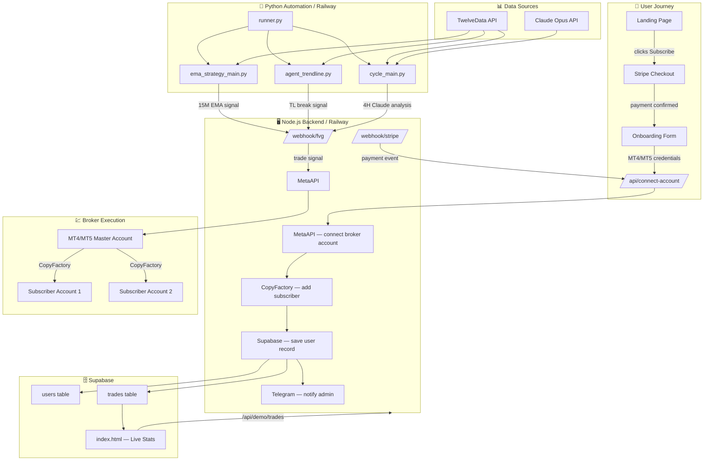

# Automated Trading Platform — Architecture

## System Overview

This is an automated gold (XAU/USD) trading platform with:
- **Frontend**: Static HTML/CSS/JS site (subscription landing + onboarding flow)
- **Backend**: Node.js/Express API (Stripe webhooks, MetaAPI, CopyFactory, Supabase)
- **Python Automation**: Multi-agent trading system (EMA strategy, HHHL structure, trendline breaks)

---

## Data Flow Diagram

---

## Component Details

### Frontend (`frontend/`)
| File | Purpose |
|------|---------|
| `index.html` | Landing page — live PnL stats, subscription plans |
| `onboarding.html` | Post-payment broker connection wizard |
| `legal.html` | Terms of service, privacy policy, risk disclosure |

### Backend (`backend/server.js`)
| Endpoint | Method | Description |
|----------|--------|-------------|
| `/webhook/stripe` | POST | Stripe payment events → trigger onboarding |
| `/checkout-session` | GET | Verify Stripe session → load onboarding state |
| `/connect-account` | POST | Link MT4/MT5 via MetaAPI + CopyFactory |
| `/webhook/fvg` | POST | Receive trade signals from Python agents |
| `/trades/history` | GET | Supabase closed trades |
| `/trades/open` | GET | Supabase open trades |
| `/pnl/today` | GET | Today's PnL aggregate |
| `/pnl/monthly` | GET | Monthly PnL aggregate |
| `/api/demo/*` | GET/POST | Mock data endpoints (portfolio/demo mode) |

### Python Automation (`automation/`)
| File | Role |
|------|------|
| `runner.py` | Thread launcher — starts all agents |
| `cycle_main.py` | 4H cycle — Claude Opus market analysis |
| `ema_strategy_main.py` | 15M EMA 20/50 crossover entries |
| `agent_trendline.py` | Trendline break detection (15M) |
| `agent_hhhl.py` | HHHL structure limit orders (local MT5) |
| `data_fetcher.py` | TwelveData API — OHLCV candles |
| `indicators.py` | EMA, ATR, pivot calculations |
| `notifier.py` | Telegram + webhook helpers |
| `config.py` | Environment config + DEMO_MODE flag |

---

## Demo Mode

Set `DEMO_MODE=true` (default) to disable all live trade execution:
- Python agents log signals but skip `/webhook/fvg` calls
- `agent_hhhl.py` exits immediately without connecting to MT5
- Backend `/api/demo/*` endpoints return realistic mock data
